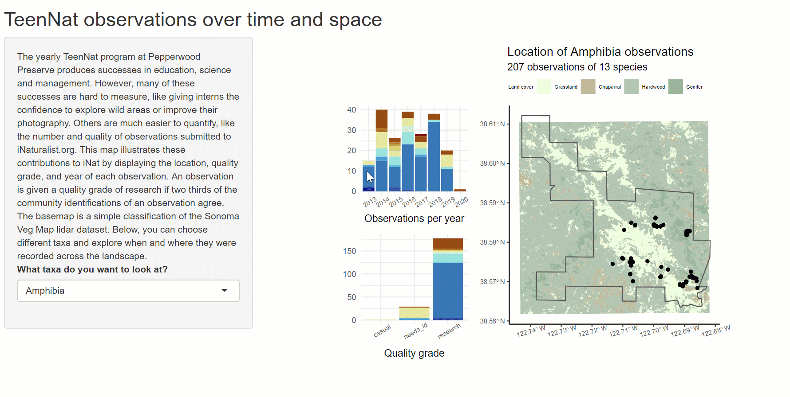

# Teennat observations

Each year [Pepperwood Preserve](https://www.pepperwoodpreserve.org/) runs a program, called [TeenNat](https://www.pepperwoodpreserve.org/what-we-do/inspiring-connections-with-nature/teennat/), in which teenagers explore the preserve and record observations of the life they find. These observations are uploaded to [iNaturalist.org](https://www.inaturalist.org/) and they put on a photography exhibition.

This shiny app gives a broad summary of these observations.

Please visit <https://samherniman.shinyapps.io/teennat_observations/> for a deployed version.

{width="890"}
